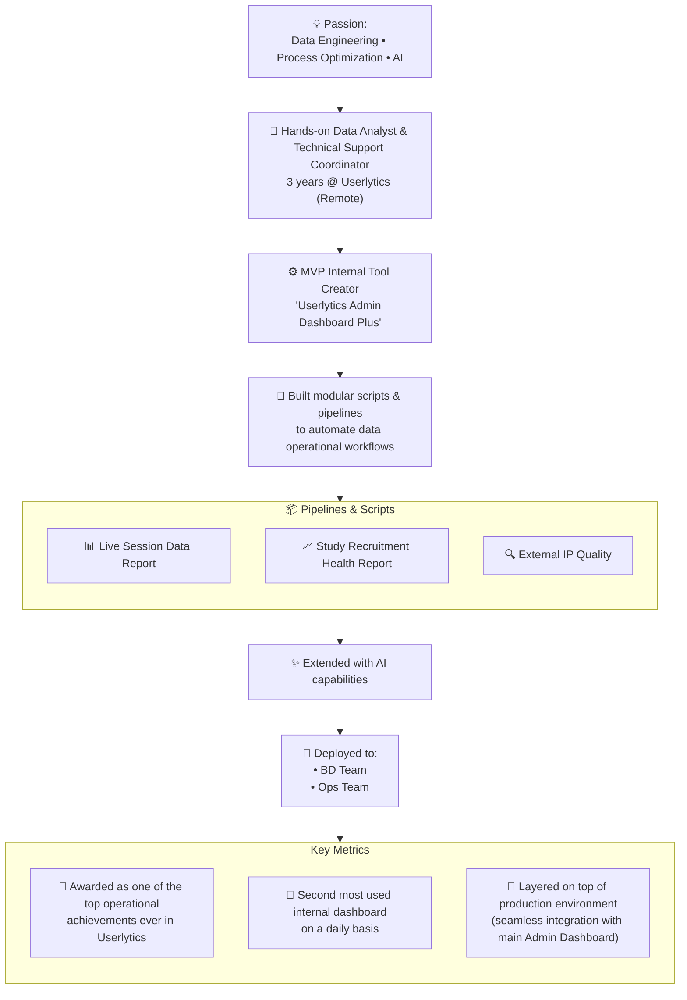

#### Hands-on, results-oriented Data Analyst and Technical Support Coordinator with 3 years of professional experience in the Operations Department of a US-based IT consulting firm.


## 🧭 Career Timeline

### 🎬 Filmmaker & Director — Self-Employed

**2015–2021**

**Key Work**
Created award-winning poetry film **“I See.”**

**Recognition**

* Vienna Poetry Festival — Official Selection
* Athens Video Poetry Festival — Official Selection
* Screened in **15+ cities worldwide**

**Core Activities**

* Directed international film project
* Managed full creative production cycle
* Screenings in Barcelona, Vienna, San Francisco, Athens

**Skills Developed**

* Narrative storytelling
* Production pipeline management
* End-to-end project delivery

**Applied to Data**
→ Finding stories in complex information
→ Managing end-to-end pipelines

---

### 💻 Technical Transition — Frontend Development & Data Automation

**2021–2023**

**Key Work**
Completed **Frontend Development Bootcamp** and began building automation scripts and internal tools.

**Recognition**

* Built foundation in **JavaScript, APIs, and data workflows**
* Developed small **automation tools and scripts**

**Core Activities**

* Learned frontend development (JavaScript, HTML, CSS)
* Built automation scripts and data workflows
* Transitioned from creative production to technical problem solving

**Skills Developed**

* Software fundamentals
* Automation workflows
* API integration basics

**Applied to Data**
→ Completed frontend bootcamp, gaining programming logic, API integration, and JSON handling—skills that later transferred directly to data work.

---

### 👨‍💻 Technical Support Coordinator & Operations Research Specialist

**Userlytics · Remote**
**2023–Present**

**Key Work**
Built MVP internal tool **“Admin Dashboard Plus.”**

**Recognition**

* **2nd most used operations dashboard**
* Recognized as a **top operational achievement** at Userlytics

**Core Activities**

* Built data pipelines and dashboards for study health
* Developed **5+ modular automation scripts**
* Integrated **IPQS fraud detection API**
* Managed **EMEA Tier 0–2 support operations**

**Skills Developed**

* Technical solution architecture
* Operational data analysis
* Automation & internal tooling

**Applied to Data**
→ Delivering operational insights and scalable internal tools



Career Evolution: From Storytelling to Data & Operations

```md
FILMMAKER (2015–2021)        TECHNICAL TRANSITION (2021–2023)        DATA / OPS ANALYST (2023–Present)
│                            │                                      │
├─ Narrative structure ───→  ├─ Frontend bootcamp                   ├─ Finding stories in data
├─ MVP project management →  ├─ JavaScript / APIs                   ├─ Building tools from scratch
├─ Abstract ideas → meaning →├─ Automation scripts                  ├─ Raw data → actionable insights
└─ International recognition →└─ Internal tools & workflows         └─ 2nd most used dashboard
```

## 💻 Programming & Scripting


## 🗄 Databases & Data Handling


## 🤖 APIs & Integrations


## ⚙️ Automation & Workflow


## 📊 Data Processing & Reporting


## 🔧 Version Control


## 🖥 Operating Systems


## 🐧 Linux System Administration


## 🎫 Ticketing Systems


## 📈 Data Visualization & Analytics


## 🤝 Collaboration & Documentation


## 🤖 Generative AI Tools


## 🏢 Office Workspace


## 🤝 Collaboration & Office Tools


## ☁️ Cloud Platforms & Data Warehousing


