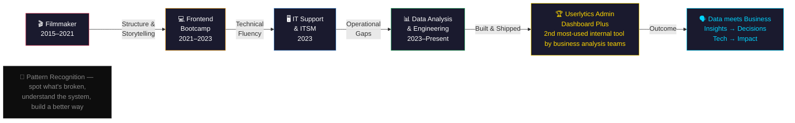

# &nbsp;👤 &nbsp;Data Analyst · Technical Support Coordinator
 
> Results-oriened Data Analyst and Technical Support Coordinator with 3 years in the Operations Department of a US-based IT consulting firm — deeply passionate about Data Engineering, Data Analysis, and AI.

## 🧭 Career Journey Overview

## ⚡ Career Timeline

### 🟦 &nbsp;2023 – Present &nbsp;·&nbsp; Technical Support Coordinator & Operations Research Specialist
**Userlytics · Remote**

What started as an IT support role quickly evolved into a data practice — gaps identified in business operations surfaced opportunities for data pipelines, automation scripts, and process improvement projects.

At Userlytics, I designed tailored data solutions to collect, process, and validate operational and panel data, transforming raw inputs into structured datasets that supported monitoring, reporting, and recruitment management. I built dashboards to track ongoing projects and study health, enabling teams to quickly identify trends and take action. I developed end-to-end study data pipelines, cleaning and analyzing research data to ensure accuracy and quality. I also integrated external datasets to enrich internal data, performing validation and verification to support actionable insights for fraud detection.

As the peak of my Data Analytics journey at Userlytics, I architected and developed **Userlytics Admin Dashboard Plus** — an MVP internal tool layered on top of the production Admin Dashboard, extended with AI capabilities, and deployed across the BD and Operations teams.

| Pipeline / Script | Description |
|---|---|
| 📊 Live Session Data Report | Automated ETL pipeline delivering real-time operational visibility |
| 📈 Study Recruitment Health Report | Modular pipeline for recruitment monitoring and study health tracking |
| 🔍 External IP Quality | Regex + API pipeline for VPN/proxy detection and fraud signal enrichment |

**Impact**
- 🏅 Awarded as one of the **top operational achievements** in Userlytics history
- 📌 **2nd most-used internal dashboard** daily across BD and Operations teams
- 🔗 Seamlessly layered on top of the production environment

> **In parallel — IT Support & ITSM:** Managed high-priority support incidents collaborating directly with the **CTO and CPO** on resolution strategies and product improvements, including **problem management** to address recurring issues at the root. Took ownership of **EMEA support operations**, consistently achieving IT support KPIs and **SLA targets** — implementing self-service resources at **Tier 0**, intelligent ticket triage and onboarding at **Tier 1**, and coordinating escalations at **Tier 2**, following **ITIL-aligned** multi-tiered workflows to ensure consistent service quality.

---

### 🟨 &nbsp;2021 – 2023 &nbsp;·&nbsp; Frontend Development Bootcamp
*Gateway to software development, IT operations, and data engineering*
 
Completed a full Frontend Development Bootcamp — not as a career destination, but as a foundation for data engineering. The transferable skills built here directly enabled Python scripting, SQL, and data pipeline work.
 
| Skill Developed | Applied To |
|---|---|
| Programming fundamentals (logic, functions, control flow) | Python scripting & automation |
| API integration & JSON data handling | Pipeline data ingestion |
| Version control · Git & GitHub | Collaborative data workflows |
| Debugging & systematic problem-solving | Data quality & issue resolution |
| Modular, reusable code architecture | Scalable pipeline design |
 
 

---

### 🟥 &nbsp;2015 – 2021 &nbsp;·&nbsp; Filmmaker & Director
**Self-Employed**

Led and directed international experimental film projects across the full production lifecycle — from concept to delivery. This chapter built a cross-disciplinary lens that now informs how data is framed, communicated, and turned into decisions.

| Film Background | Data Parallel |
|---|---|
| Narrative storytelling | Finding the story inside complex data |
| Production pipeline management | End-to-end data workflow design |
| End-to-end project delivery | Shipping tools that teams actually use |

 

---
## 🛠 &nbsp;Tech Stack & Skills

 

**💻 Programming & Scripting**

 

**🗄 Data & Databases**

 

**📊 Data Analysis**

 

**📈 Data Visualization**

 

**🤖 APIs, Automation & AI**

 

**☁️ Cloud**

 

**🔧 Version Control & OS**

 

**🎫 Tooling & Workspace**

 

**🛡 ITSM & Support**

 

**🤝 Soft Skills**

